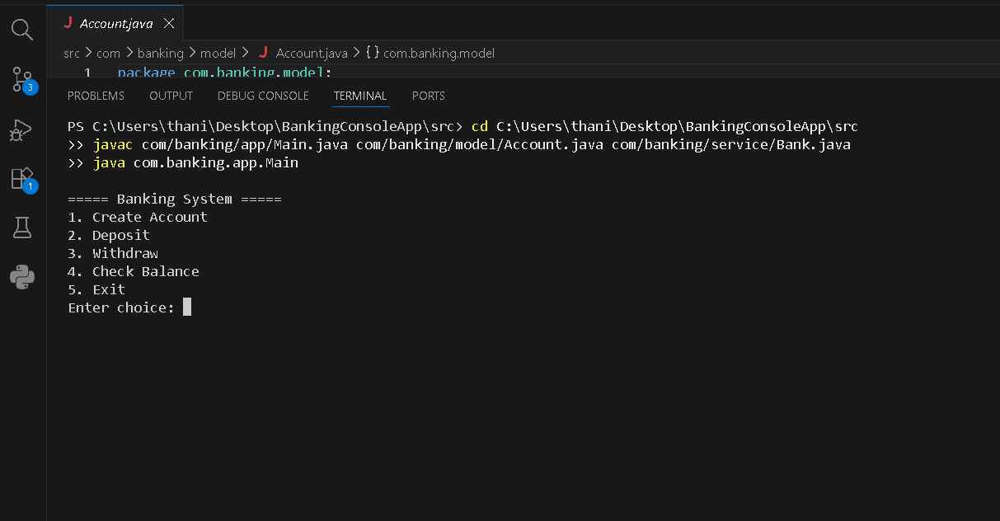

#  Banking Console Application

A Java-based console banking application that simulates basic banking operations using Object-Oriented Programming (OOP) principles.

---

##  Project Overview

The Banking Console System is a menu-driven Java application that allows users to perform essential banking operations through the terminal.

This project demonstrates strong understanding of:

- Object-Oriented Programming (OOP)
- Package structure
- Class design
- Encapsulation
- Method interaction
- Console-based user input handling

---

##  Application Menu

```
===== Banking System =====
1. Create Account
2. Deposit
3. Withdraw
4. Check Balance
5. Exit
Enter choice:
```

---

##  Features

- Create a new bank account
- Deposit money into an account
- Withdraw money from an account
- Check account balance
- Exit system safely
- Structured using layered package architecture


---

##  Tech Stack

- Java
- OOP Concepts
- Console Application
- Package-based Architecture

---

##  How To Run

1️⃣ Navigate to the `src` folder:

```
cd src
```

2️⃣ Compile the project:

```
javac com/banking/app/Main.java com/banking/model/Account.java com/banking/service/Bank.java
```

3️⃣ Run the application:

```
java com.banking.app.Main
```

---

## 📸 Screenshots

### 🖥 Main Menu


---


## 🎯 Learning Outcome

This project helped in understanding:

- Real-world project folder structure
- Package management in Java
- Method interaction between service and model layers
- Basic banking transaction logic

---

## 👨‍💻 Author

**Thanish**
